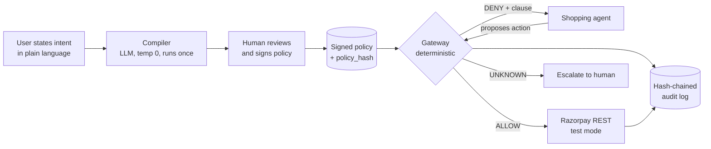

# Architecture

Mandate sits between an AI agent and the payment rail. It takes a signed policy document and enforces it deterministically on every attempted money movement.

## The request path

Every call into Mandate arrives at `Gateway.propose(action, now)`. Execution follows eight discrete steps:

1. **Reconciliation (I/O).** The gateway checks the ledger for existing entries with the same idempotency key. If an entry exists in `PENDING` state, it queries the downstream rail (`find_orders_by_receipt`) to resolve whether the previous attempt succeeded or failed.
2. **Short-circuit on idempotency (pure).** If a terminal entry (`COMMITTED` or `ROLLED_BACK`) already exists for this idempotency key, the gateway returns the cached verdict immediately without re-executing.
3. **State accumulation (pure).** The gateway computes accumulated spend, transaction counts, and recent purchases from the ledger history.
4. **Resolution (I/O & cache).** The resolver checks merchant names and categorises line items. Uncached product titles query the category model and cache the result.
5. **Constraint evaluation (pure).** `evaluate_all` runs all nine constraint evaluators:
   - `budget.total`
   - `budget.per_transaction`
   - `budget.per_item`
   - `merchant.allow`
   - `category.deny`
   - `item.deny_recent`
   - `velocity`
   - `time.window`
   - `quantity.max_per_item`
   `evaluate_all` always runs every evaluator to completion, even after an evaluator returns `DENY`. This guarantees that the audit record captures the full evaluation state across all clauses rather than stopping at the first failure.
6. **Lattice combination (pure).** Individual clause verdicts combine under a lattice where `DENY` dominates `UNKNOWN`, and `UNKNOWN` dominates `ALLOW`.
7. **Downstream execution (I/O).**
   - In `ENFORCE` mode: If the combined verdict is `ALLOW`, the gateway opens a `PENDING` ledger entry, calls `downstream.create_order`, and updates the entry to `COMMITTED` (or leaves it `PENDING` on timeout). If denied or escalated, downstream is never called.
   - In `OBSERVE` mode: The gateway logs the verdict but executes downstream regardless, allowing benchmark comparison against an unconstrained baseline.
8. **Audit append (I/O).** The proposal, all nine clause results, final verdict, downstream response, and SHA-256 hash chain link are appended to the tamper-evident audit log.

## The PENDING problem and three-state ledger

In distributed payments, network timeouts do not mean an operation failed. If a network socket drops while awaiting a response from Razorpay, the order may have been created and charged on the downstream rail. Treating a timeout as a rollback results in double-spending.

The ledger tracks each action through three states:
- `PENDING`: The proposal passed evaluation and downstream execution started.
- `COMMITTED`: The downstream confirmed order creation with an order ID.
- `ROLLED_BACK`: Downstream explicitly returned an error or reconciliation confirmed no order was created.

Crucially, `open_pending` writes to disk before the downstream HTTP request is dispatched. Budget calculations sum both `COMMITTED` and `PENDING` transactions. If an agent times out and retries with a new payload, the pending amount remains counted against the budget limit until reconciliation verifies the outcome.

## Resolution and sanitisation

Merchant and category resolution isolate raw input strings from matching logic:

- **Merchant matching is exact-only.** Case folding and whitespace trimming are applied, but fuzzy matching is intentionally avoided. Unicode `NFKC` normalisation strips character format variations but does not fold lookalike Latin/Cyrillic homoglyphs (such as Cyrillic 'а' vs Latin 'a'). Homoglyph attacks are detected and rejected as unrecognised merchants.
- **Explicit unknown state.** Categories outside the curated dictionary are sent to the classification model. If the category cannot be resolved with certainty, the resolver returns `UNKNOWN`. Under the lattice, an `UNKNOWN` category escalates to human review rather than passing through.

## The two arms: observe vs enforce

Measuring policy effectiveness requires an unconfounded control group. Mandate implements both experimental arms in the exact same gateway:

- `Mode.OBSERVE`: The control arm. The gateway compiles the policy, accumulates state, resolves merchants and categories, and runs all evaluators. However, it does not block non-compliant orders. It executes downstream, logging what a prompt-only agent did.
- `Mode.ENFORCE`: The treatment arm. The gateway blocks any action that fails evaluation, halting downstream calls on `DENY` or `UNKNOWN`.

Using a single boolean flag inside the same codebase ensures that the baseline and enforcement arms share the exact same prompt, catalog parser, model driver, and network path. Any observed difference in containment is strictly attributable to deterministic policy enforcement.
